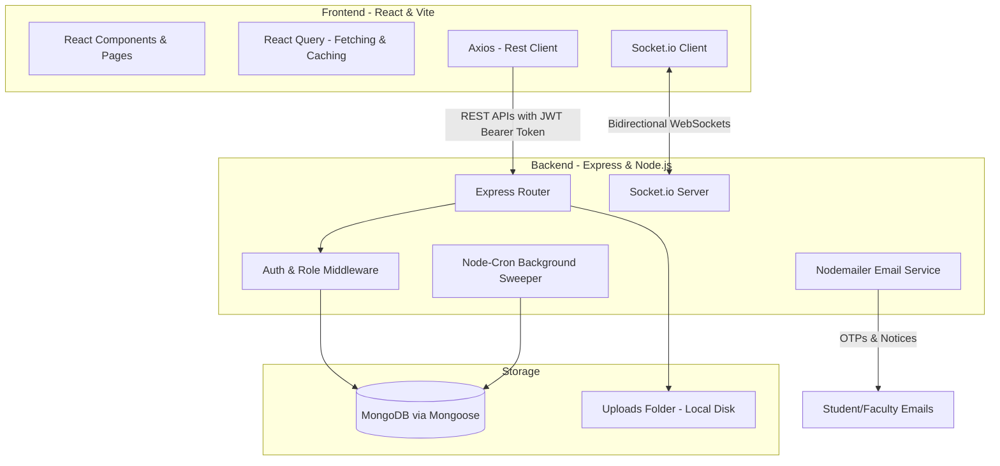
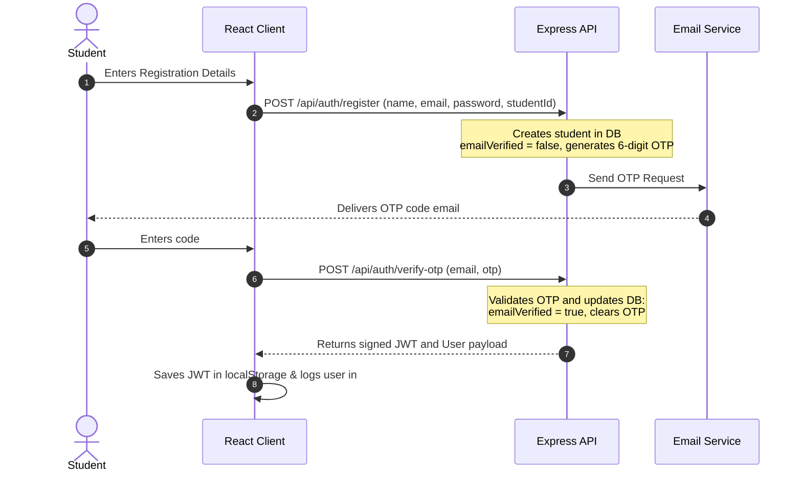
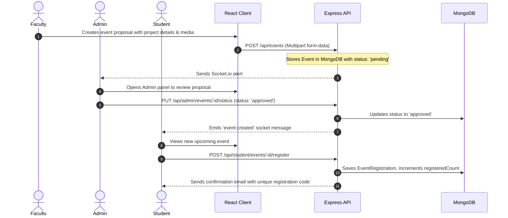
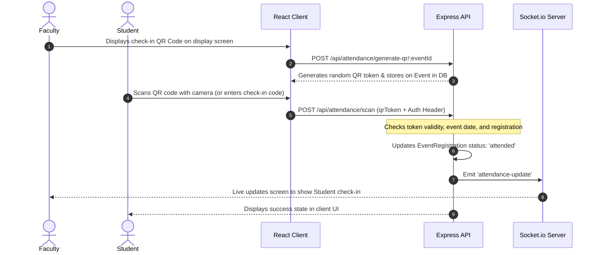

# Project Architecture & Workflow Breakdown

This document provides a comprehensive breakdown of the **Club Hub Admin** project architecture, user workflows, data flow mechanisms, and active features based on an audit of the repository.

---

## 1. System Architecture Overview

The system is structured as a decoupled client-server web application:



### Core Technologies
- **Frontend**: React 18, TypeScript, Vite, React Router DOM, Tailwind CSS, shadcn-ui, Lucide Icons, Framer Motion (for animations), and **React Query** (`@tanstack/react-query`) for API querying, mutation, and caching.
- **Backend**: Node.js, Express, **Mongoose** (MongoDB Object Modeling), **Socket.io** (real-time integration), **Node-Cron** (automated background jobs), **Nodemailer** (email operations), and **PDFKit** (attendance PDF generation).

---

## 2. Active Features by User Role

The application distinguishes permissions and features across three core roles: **Student**, **Faculty**, and **Admin**.

```
                           ┌───────────────┐
                           │   User Roles  │
                           └───────┬───────┘
                                   │
         ┌─────────────────────────┼─────────────────────────┐
         ▼                         ▼                         ▼
   ┌───────────┐             ┌───────────┐             ┌───────────┐
   │  Student  │             │  Faculty  │             │   Admin   │
   └───────────┘             └───────────┘             └───────────┘
```

### 👨‍🎓 Student Portal Features
- **OTP Verification**: Sign up verification via a 6-digit OTP code sent using email services.
- **Clubs Hub**: View active clubs, join, or leave clubs (recalculates club metrics instantly).
- **Events Hub**: Discover upcoming approved events, register for events, cancel registration (with a 2-hour pre-event deadline), and view finished event histories.
- **QR / Manual Event Check-In**: Scan check-in QR codes or submit codes manually to mark event attendance.
- **Feedback & Rating Loop**: Provide structured ratings and comments on clubs or attended events, and view faculty responses to submitted feedback.
- **In-App Messaging**: Real-time direct chat restricted to faculty members.
- **Real-Time notifications**: Receive notifications when event details or statuses update.

### 👩‍🏫 Faculty Panel Features
- **Dashboard Metrics**: Analyze registrations, feedback count, event health, and ratings.
- **Club Management**: Oversee club member databases, view member profiles, and respond to student feedback (sends automated email responses).
- **Event Management**: Create, edit, and delete events. Define venues, max capacities, agendas, external/internal participant estimates, and upload attachments (brochures, guidelines).
- **Attendance Processing**: Generate custom session check-in QR codes, manually toggle attendance status, bulk-approve student lists, and generate signed A4 attendance PDFs using `pdfkit`.
- **Budget Requests**: Create event budget requests (INR) and request approvals from admins.
- **Real-Time Messaging**: Engage in dual-directional chat conversations with Admins and Students.

### 👑 Admin Panel Features
- **Club Lifecycle Management**: Create, edit, and delete clubs; manage categories, description assets, and allocate budgets.
- **Faculty Management & Assignments**: Create faculty accounts, assign/reassign faculty to clubs, and trigger temporary password resets sent via emails.
- **Event & Report Approvals**: Review proposed events and approve/reject them to control visibility for students.
- **Asset/Media Management**: Centralized upload library access with soft delete (Trash), restore, and permanent deletion controls.
- **Club Health Score Index**: Automated computation of "Health Statuses" (Healthy, Warning, Critical) calculated using participation, attendance, event count, and budget utilization efficiency.
- **Universal Messenger**: Coordinate and chat directly with all students, faculty members, and other admins.

---

## 3. Core Data Flows & Interactions

### Authentication & API Security
- **JWT Authorization**: Frontend Axios instance ([`api.ts`](file:///C:/Users/aksha/Desktop/club-hub-admin/club-hub-admin/src/api/api.ts)) intercepts requests to read the JWT token from `localStorage` and inject it in the `Authorization: Bearer <token>` header.
- **Role Verification**: Requests flow through the auth middleware ([`auth.js`](file:///C:/Users/aksha/Desktop/club-hub-admin/club-hub-admin/backend/middleware/auth.js)) which decodes the JWT and sets `req.user`. Downstream routes use role checks (e.g. `permit("admin", "faculty")`) to block unauthorized operations.

### Real-Time Communications
- **Socket Rooms**: Upon connecting, clients trigger `register`, which binds their socket connection to three targeted rooms:
  1. Individual User Room (`userId`)
  2. Role Room (`role` e.g., `"faculty"`, `"admin"`)
  3. Associated Club Rooms (`club:clubId`)
- **Direct Messaging**: Direct messages sent to `/api/messages` trigger REST payloads that save messages to MongoDB, coupled with immediate Socket emits to the recipient's room to update chat feeds instantly.

---

## 4. Primary User Workflows

### A. Student Onboarding & Registration
This workflow represents the onboarding path:



### B. Event Planning, Approval & Registration
This workflow demonstrates how faculty create events and how students register for them:



### C. Live Event Attendance Check-in
This workflow shows the real-time event check-in mechanism:



---

## 5. Background Services & Integrations

1. **Background Attendance Sweeper (`node-cron`)**
   - **Trigger**: Runs every 5 minutes (`*/5 * * * *`) on the backend.
   - **Function**: Queries all events in the database. If an event's date and start time are in the past, it updates any registrations still marked as `"registered"` to `"absent"`, ensuring clean attendance records without manual intervention.
2. **Club Health Analytics**
   - **Trigger**: Runs on change events (adding events, changing members, marking attendance, allocating budget).
   - **Function**: Calculates a weighted score out of 100 based on:
     - Events count (up to 40 points)
     - Member participation rates (up to 30 points)
     - Student attendance rates (up to 20 points)
     - Proof upload rates (up to 30 points)
     - Budget utilization efficiency (up to 20 points)
     - Active membership size bonus (up to 10 points)
   - Categorizes clubs into: `"healthy"` (Score $\ge$ 70), `"warning"` (Score $\ge$ 40), or `"critical"` (Score $<$ 40).
3. **Nodemailer**
   - Integrated with Gmail to send automated communications (invites, updates, responses, and authorization codes).
4. **PDF Document Generation (`pdfkit`)**
   - Creates print-ready, double-ruled attendance sheets populated with student register numbers, names, and signature blocks.
5. **Multer (Static Assets Engine)**
   - Uploads files locally to the `uploads/` directory. Static files are served via `/uploads/` route endpoints. Files have lifecycle actions (moving to Trash, recovery, permanent deletion).
