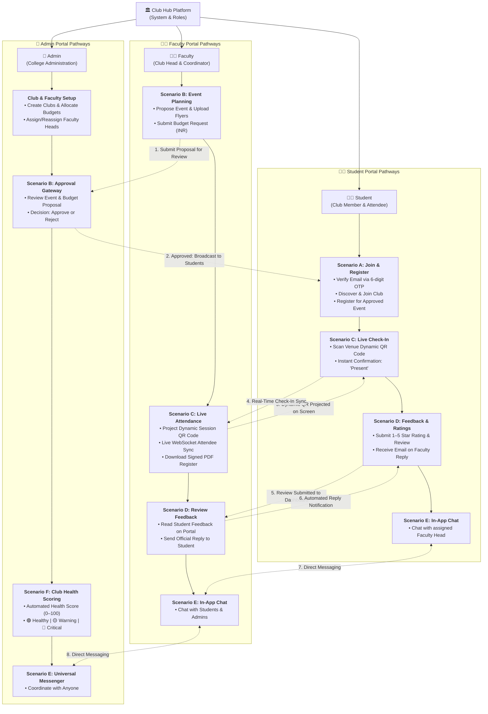
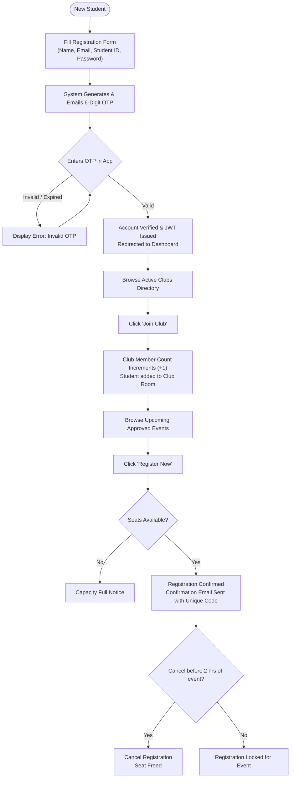
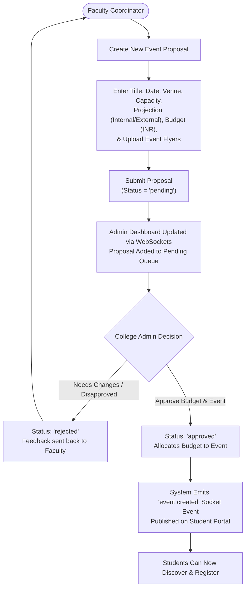
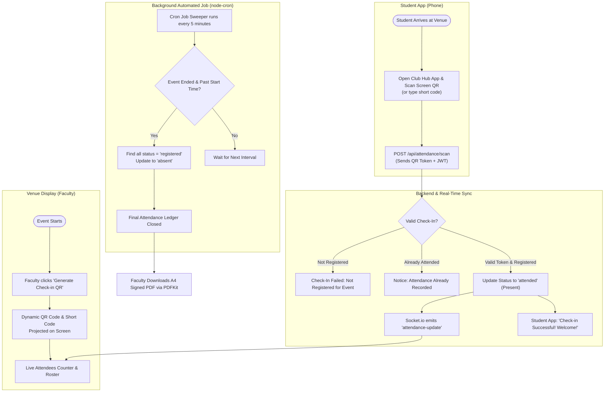
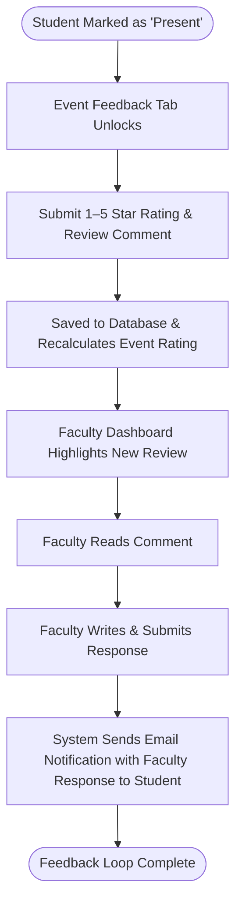
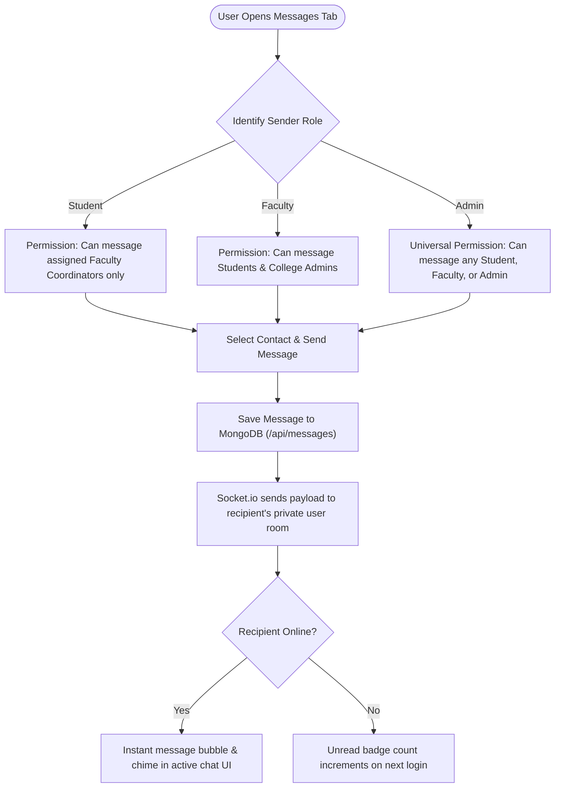
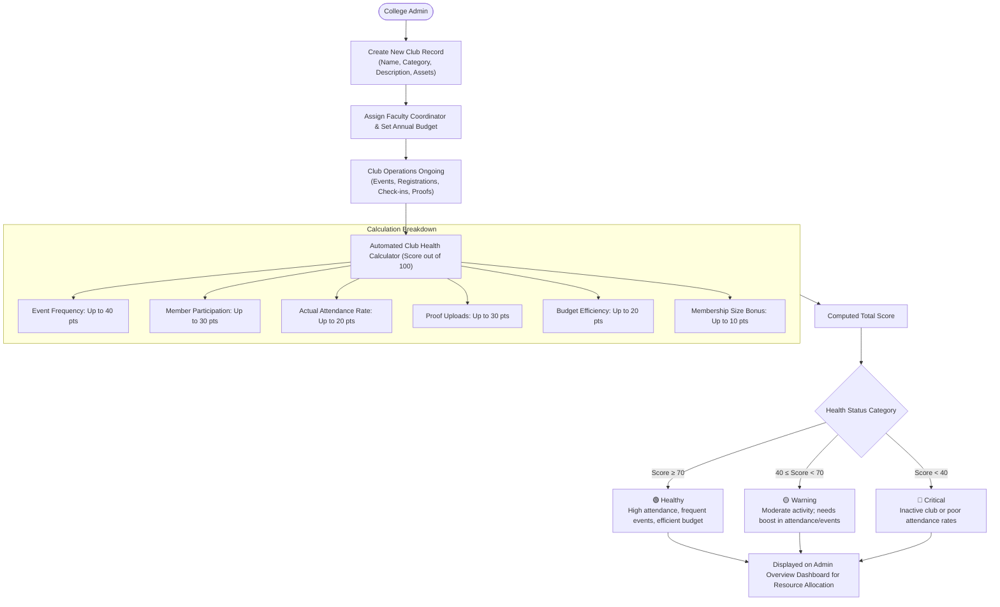

# Club Hub: User Guide Scenario Flowcharts

This document provides visual flowcharts and decision diagrams for all key user workflows and scenarios within the **Club Hub** platform. It acts as a visual companion to the [user_guide.md](file:///c:/Users/aksha/Desktop/club-hub-admin/club-hub-admin/docs/user_guide.md) and [architecture_breakdown.md](file:///c:/Users/aksha/Desktop/club-hub-admin/club-hub-admin/docs/architecture_breakdown.md).

---

## 1. Role-Based Platform Flowchart (Who Uses Club Hub)

This flowchart mirrors the **"Who Uses Club Hub"** hierarchy, branching directly from the **Club Hub Platform** into the three core user roles (**Student**, **Faculty**, and **Admin**), showing how each scenario flows under their respective portal and interacts with other roles.

### 📊 Visual Box Diagram

```
                                 ┌─────────────────────────────────┐
                                 │       Club Hub Platform         │
                                 │  (Role & Scenario Workflows)    │
                                 └────────────────┬────────────────┘
                                                  │
          ┌───────────────────────────────────────┼───────────────────────────────────────┐
          ▼                                       ▼                                       ▼
    ┌───────────┐                           ┌───────────┐                           ┌───────────┐
    │  Student  │                           │  Faculty  │                           │   Admin   │
    │ (Member)  │                           │(Club Head)│                           │ (College) │
    └─────┬─────┘                           └─────┬─────┘                           └─────┬─────┘
          │                                       │                                       │
   [Scenario A: Join & Register]           [Scenario B: Propose Event]             [Club & Faculty Setup]
   • Sign up with 6-digit OTP              • Draft title, date, venue              • Create clubs & set budget
   • Join club (+1 member count)           • Request budget (INR)                  • Assign faculty to clubs
   • Register for event                    • Upload flyers & posters                       │
          │                                       │                                        │
          │                                       ▼                                        ▼
          │                                [Submit Proposal] ───────────────────> [Review Event & Budget]
          │                                                                                │
          │                                                                        ┌───────┴───────┐
          │                                                                        ▼               ▼
          │ <────────────────────────────── [Publish Event] <──────────────── [Approve]        [Reject]
          │                                                                                        │
          ▼                                       │                                                ▼
   [Scenario C: Event Check-In]            [Scenario C: Live Session]                      [Notify Faculty]
   • Arrive at event venue                 • Project Dynamic QR on screen
   • Scan screen QR with phone             • Watch live attendance count
          │                                       │
          └──────── (Real-Time Scan) ───────────> │
                                                  • Auto-mark absents (Sweeper)
                                                  • Download signed PDF sheet
                                                          │
          ┌───────────────────────────────────────────────┘
          ▼
   [Scenario D: Feedback & Ratings]        [Scenario D: Respond to Feedback]
   • Submit 1-5 stars & comment ─────────> • Read reviews on dashboard
   • Receive email with reply <─────────── • Write reply to student
          │                                       │
          ▼                                       ▼
   [Scenario E: Messaging]                 [Scenario E: Messaging]                 [Scenario F: Club Health]
   • Chat with Faculty Coordinator <─────> • Chat with Students & Admins <───────> • Track Health Score (0-100)
                                                                                   • Healthy / Warning / Critical
```

### 🔀 Interactive Multi-Role Flowchart



---

## 2. Detailed Scenario Flowcharts

---

### 🔹 Scenario A: Student Onboarding, Club Joining & Event Registration

This workflow illustrates how a new student registers, validates their account via email OTP, joins a college club, and books an event seat.



---

### 🔹 Scenario B: Event Planning, Budget Request & Admin Approval

This workflow outlines how faculty club coordinators propose events, request funds, and submit them for college administrative approval before publishing to students.



---

### 🔹 Scenario C: Live Event QR Check-In & Automated Attendance Sweeper

This workflow maps real-time venue check-in using dynamically generated QR tokens, instant attendee sync, and automated background sweeping for no-shows.



---

### 🔹 Scenario D: Post-Event Feedback & Response Loop

This workflow covers post-event student ratings, public reviews, and direct faculty responses with automated notification emails.



---

### 🔹 Scenario E: Real-Time In-App Messaging & Role Permissions

This workflow illustrates direct messaging capabilities, security boundaries, and WebSocket delivery between platform users.



---

### 🔹 Scenario F: Club Lifecycle Administration & Health Scoring

This workflow explains how administrators govern clubs and how the system dynamically scores club performance.


